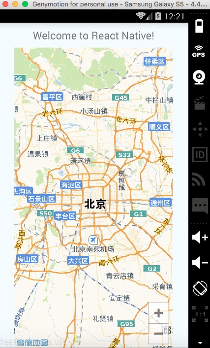

# React Native AMap
A React Native component for building maps with the [AMap Android SDK](http://lbs.amap.com/api/android-sdk/summary/).

## Example
```
...
import MapView from 'react-native-amap';

class example extends Component {
  render() {
    return (
      <View style={styles.container}>
        <Text style={styles.welcome}>
          Welcome to React Native!
        </Text>
        <MapView mode={1} style={{ flex: 1, width: 300, }} />
      </View>
    );
  }
}
...
```


## Install

### Step 1 - NPM install

```
npm install react-native-amap --save
```

### Step 2 - Update Gradle Settings

```
// file: android/settings.gradle
...

include ':reactamap'
project(':reactamap').projectDir = new File(rootProject.projectDir, '../node_modules/react-native-amap')
```

### Step 3 - Update app Gradle Build

```
// file: android/app/build.gradle
...

dependencies {
    ...
    compile project(':reactamap')
}
```

### Step 4 - Register React Package

#### react-native >= v0.18.0
```
import com.laoqiu.amap.AMapReactPackage;
...
   /**
   * A list of packages used by the app. If the app uses additional views
   * or modules besides the default ones, add more packages here.
   */
    @Override
    protected List<ReactPackage> getPackages() {
      return Arrays.<ReactPackage>asList(
        new MainReactPackage(),
        new AMapReactPackage()); // <-- Register package here
    }
...
```
#### react-native < v0.18.0
```
    @Override
    protected void onCreate(Bundle savedInstanceState) {
        super.onCreate(savedInstanceState);
        mReactRootView = new ReactRootView(this);
        mReactInstanceManager = ReactInstanceManager.builder()
        		...
				.addPackage(new AMapReactPackage()) // <-- Register package here
				...
				.build();
		...
```
### Step 5 - Add map permission and api key

```
// file: android/app/src/main/AndroidManifest.xml
	...
	<uses-permission android:name="android.permission.INTERNET" />
    <uses-permission android:name="android.permission.WRITE_EXTERNAL_STORAGE" />
    <uses-permission android:name="android.permission.ACCESS_NETWORK_STATE" />
    <uses-permission android:name="android.permission.ACCESS_WIFI_STATE" />
    <uses-permission android:name="android.permission.READ_PHONE_STATE" />
    <uses-permission android:name="android.permission.ACCESS_COARSE_LOCATION" />
    <uses-permission android:name="android.permission.ACCESS_FINE_LOCATION" />
    <uses-permission android:name="android.permission.ACCESS_LOCATION_EXTRA_COMMANDS" />
    <uses-permission android:name="android.permission.ACCESS_MOCK_LOCATION" />
    <uses-permission android:name="android.permission.CHANGE_WIFI_STATE" />
    <application
      android:allowBackup="true"
      android:label="@string/app_name"
      android:icon="@mipmap/ic_launcher"
      android:theme="@style/AppTheme">
      <meta-data
         android:name="com.amap.api.v2.apikey"
         android:value="your app key here"/>
   ...
```
